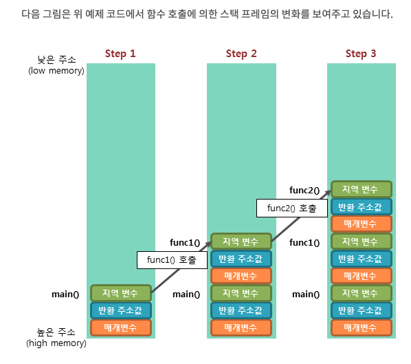
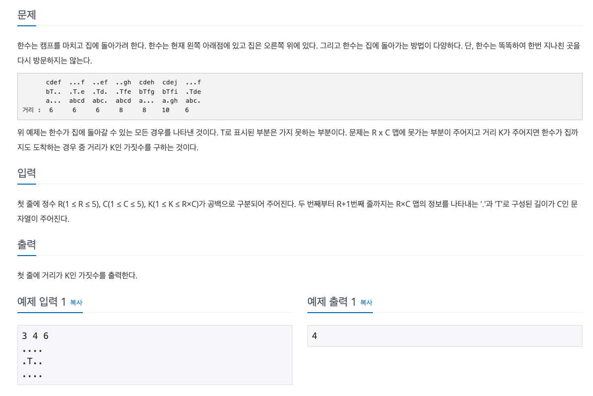

# 문제를 풀기 전 스택 프레임을 살짝 맛만..

Step 1. 프로그램이 실행되면, 가장 먼저 main() 함수가 호출되어 main() 함수의 스택 프레임이 스택에 저장됩니다.
Step 2. func1() 함수를 호출하면 해당 함수의 매개변수, 반환 주소값, 지역 변수 등의 스택 프레임이 스택에 저장됩니다.
Step 3. func2() 함수를 호출하면 해당 함수의 스택 프레임이 추가로 스택에 저장됩니다.
Step 4. func2() 함수의 모든 작업이 완료되어 반환되면, func2() 함수의 스택 프레임만이 스택에서 제거됩니다.
Step 5. func1() 함수의 호출이 종료되면, func1() 함수의 스택 프레임이 스택에서 제거됩니다.
Step 6. main() 함수의 모든 작업이 완료되면, main() 함수의 스택 프레임이 스택에서 제거되면서 프로그램이 종료됩니다.
이처럼 스택은 가장 나중에 저장된 데이터가 가장 먼저 인출되는 방식으로 동작합니다.
이러한 방식을 후입선출(LIFO, Last-In First-Out) 방식이라고 합니다.
이때 스택은 푸시(push) 동작으로 데이터를 저장하고, 팝(pop) 동작으로 데이터를 인출합니다.
---
# 문제

